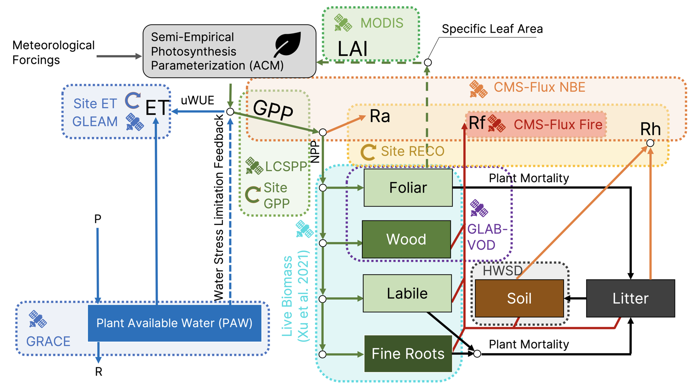

=================
Data Requirements
=================

We provide example driver files at 
`Zenodo <https://doi.org/10.5281/zenodo.13984225>`_.

To run DifferLand, the following input files are required:

* *differland_global_driver_v6.nc*:
  Contains spatial predictors, atmospheric forcings (except CO₂ concentration), 
  and target variables used to constrain vegetation dynamics.

* *co2_mm_gl_01_23.csv*:
  Monthly atmospheric CO₂ concentration data.

* *era_valid_v6.nc*:
  Defines valid land pixels (excluding open water, permanent snow/ice, and 
  sparsely vegetated regions).

* *run_simulation_idx_v6.nc*:
  Provides random indices for shuffling data and splitting into training, 
  validation, and test sets for ensemble experiments.

* *assimilate_bulk_variable_v6.nc*:
  Defines patches with sufficient vegetated land area for assimilation of 
  coarse-resolution variables.

* *predictor_mean_v6.csv* and *predictor_std_v6.csv*:
  Pre-computed mean and standard deviation of predictors for each training split,  
  enabling fast normalization during SHAP computation.

These files are sufficient to reproduce the training and evaluation experiments 
described in the study.

DifferLand requires three categories of inputs: **spatial predictors** (P), 
**forcing variables** (m), and **observational constraints** (yₒ). While default 
datasets are provided below, the framework is flexible and can be readily adapted 
to incorporate alternative data sources.

-----------------
Spatial Predictors
-----------------

Spatial predictors (P) are static variables describing vegetation, climate, soils, 
and ecosystem structure. They are grouped into four categories:

* **PFT (Plant Functional Types):**
  - MODIS MCD12C1.v061 fractions aggregated to 0.25° resolution
  - Consolidated into 11 land cover classes
  - Pixels dominated by water (>50%) or barren land (>20%) are excluded

* **CLIM (Climate):**
  - Mean annual temperature (MAT, °C) and precipitation (MAP, mm) from ERA5 (2001–2023)
  - Elevation (ELE, m) from GTOPO30

* **AGE (Forest Age & Structure):**
  - Forest age (years) from global ML-based dataset (circa 2010)
  - Non-forest pixels assigned age = 1 year
  - Maximum canopy height (CAN.H, m) from ETH Global Sentinel-2 dataset

* **SOIL:**
  - Bulk density and texture fractions (sand, silt, clay, gravel)
  - From Harmonized World Soil Database v1.2
  - Depth-weighted average over 0–100 cm

All predictors are harmonized to a **0.25° grid** and treated as temporally invariant.

----------------
Forcing Variables
----------------

Forcing variables (m) drive the DALEC terrestrial biosphere model:

* **Meteorological forcing (ERA5, 2001–2023):**
  - Daily min/max temperature
  - Precipitation rate
  - Shortwave downward radiation
  - Vapor pressure deficit (VPD)

* **Atmospheric CO₂:**
  - Monthly global mean concentrations from NOAA GML

* **Fire forcing:**
  - Burned area fractions from GFED5 (2001–2020)
  - Extended to 2021–2023 with MODIS MCD43A1.v061 burned area fraction

------------------------
Observational Constraints
------------------------

Observational constraints (yₒ) are assimilated into DifferLand to optimize 
parameters and state variables:

* **Vegetation and productivity:**
  - MODIS SIF proxy (2001–2023)
  - MODIS LAI v6.1 (2001–2023)
  - GLEAM v4.21a ET (2001–2023)
  - GLAB-VOD (2010–2020)
  - Live biomass from Xu et al. 2020 (2001–2019)

* **Carbon cycle:**
  - GFED5 fire emissions (2001–2020; patch-level assimilation)
  - CMS-Flux NBE (2010–2022)

* **Water cycle:**
  - GRACE/GRACE-FO Mascon Equivalent Water Thickness (2002–2023)

* **Eddy covariance fluxes:**
  - GPP, RECO, ET from FLUXNET2015, ICOS, OzFlux, AmeriFlux
  - Strict representativeness filtering applied
  - Aggregated to 0.25° where multiple towers exist
  
.. _differland-data-fig:

------------------------
Alternative Data Sources
------------------------

DifferLand is **flexible** and supports alternative observational streams. 
Sensitivity tests have included the following substitutions:

* **NBE:** Copernicus CAMS inversion (2001–2023), constrained by ground-based CO₂
* **LAI:** Copernicus LAI (2001–2023), MODIS-independent product
* **Biomass:** IB-AGC (2010–2020), L-VOD–based biomass product
* **VOD:** GLAB-VOD (2003–2020), assimilated at annual level using linear operator
* **Fire emissions:** CMS Carbon Flux for Fire (2010–2016), informed by MOPITT CO

----------------------------
Summary of Default vs. Alternative
----------------------------

.. list-table::
   :header-rows: 1
   :widths: 20 20 20 20 20 20

   * - OPTIONS
     - NBE
     - LAI
     - Biomass
     - VOD
     - Fire Emission
   * - DEFAULT
     - CMS-Flux (2010–2022)
     - MODIS LAI v6.1 (2001–2023)
     - Xu et al. 2020 (2001–2019)
     - Not used
     - GFED5 (2001–2020)
   * - ALTERNATIVE
     - CAMS (2001–2023)
     - Copernicus LAI (2001–2023)
     - IB-AGC (2010–2020)
     - GLAB-VOD (2003–2020)
     - CMS-Flux Fire (2010–2016)

-----------------
User Flexibility
-----------------

Users are encouraged to **experiment with new data streams** as they become 
available. DifferLand’s modular design allows substitution or addition of 
observational constraints, enabling the community to evaluate the effects 
of emerging datasets on model parameterization and predictions.
