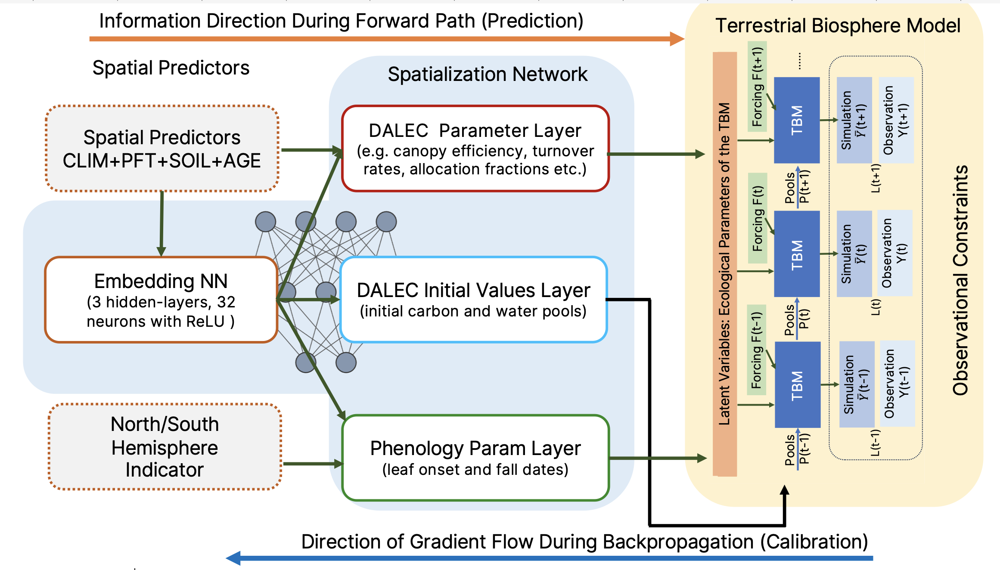

DifferLand Overview
====================

Main Components
-------------------

DifferLand integrates machine learning and process-based ecosystem modeling in a fully
differentiable framework. The configuration consists of three main components:

1. **Spatialization Neural Network (``f_nn``)**  
   Maps spatial predictors into ecological parameters, including DALEC process
   rates, initial pool values, and phenology constants.

2. **Process-Based Terrestrial Biosphere Model (``f_M``)**  
   A differentiable version of the DALEC model simulating carbon allocation,
   respiration, turnover, decomposition, phenology, and water fluxes.

3. **Loss Function (``L``)**  
   Compares simulated outputs against observations (e.g. NEE, LAI, ET, SIF,
   biomass, SOC) with additional soft constraints to ensure stability.

.. _differland-fig:

The detailed design of the spatialization network. The spatialization network (shown in blue) consists of an
embedding NN that first uses spatial predictors to learn an embedding of environmental conditions at each 0.25° pixel.
The embedding is then passed into three output layers to predict, respectively,
the initial conditions (N=7, e.g., carbon and water stock in each pool at time zero),
the ecological parameters (N=31, e.g., allocation fractions to different pools, canopy efficiency,
Q10, and turnover rates), and the phenology parameters of the DALEC model (N=2, leaf onset & fall days).
A North/South hemisphere variable identifies the austral and boreal phenology cycles 
(with sigmoid activation between ± 10° to smooth the transition).
The predicted initial conditions and model parameters are passed into the differentiable DALEC model
to simulate ecosystem dynamics and compute an optimization target based on observational constraints.
During the backward pass, the gradient of the neural parameters with respect to the loss function 
is used to update each layer in the spatialization NN. 

Spatialization Network
----------------------

The neural network has:

* 3 hidden layers with 32 neurons each
* ReLU activation functions
* Xavier initialization for weights (bias = 1)
* Outputs:
   - DALEC parameters (31)
   - Initial pools (7)
   - Phenology parameters (2)

A transformation maps parameters from real space into their physical ranges.

**Equation (1):**

.. math::

   \theta_M^k, \theta_i^k = f_{nn}(P^k \mid \theta_{nn})

where :math:`k` denotes pixel index. Parameters :math:`\theta_{nn}` are shared
globally.

Process-Based Model
-------------------

DALEC is implemented in an automatically differentiable form, enabling gradient
computation for all parameters and variables.

At each timestep:

**Equation (2):**

.. math::

   \hat{y}_o^{(k,t)}, \hat{y}_u^{(k,t)}, x^{(k,t+1)} = f_M(x^{(k,t)}, m^{(k,t)} \mid \theta_M^k)

Substituting Equation (1):

**Equation (3):**

.. math::

   \hat{y}_o^{(k,t)}, \hat{y}_u^{(k,t)} = f_M(m^{(k,1)}, \ldots, m^{(k,t)} \mid P^k, \theta_{nn})

Loss Function
-------------

The loss is a weighted mean squared error across observed variables:

**Equation (4):**

.. math::

   L = \sum_{k,t,v} \alpha_v \big(\hat{y}_o^{(k,t,v)} - y_o^{(k,t,v)}\big)^2 + L_{constraint}

* :math:`\alpha_v` – weights for each variable
* :math:`L_{constraint}` – terms penalizing implausible water/carbon dynamics

Implementation
--------------

* **Framework:** JAX (automatic differentiation in Python)  
* **Design goal:** Parsimonious but mechanistically faithful  
* **Outputs:** Differentiable environemnt-parameter functions informed by spatial predictors,
  meteorological forcing, and process-based dependencies. These relationships can then be used
  to predict ecological parameters and produce simulations of global vegetation dynamics.

This design allows DifferLand to balance **interpretability** and **flexibility**
in global ecological inference.
