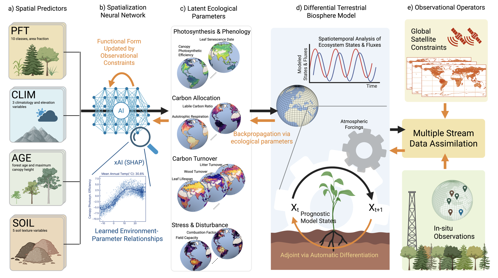

###################################
 DifferLand (Global) documentation
###################################

**DifferLand** is a JAX-based hybrid-machine learning terrestrial biosphere
modeling framework designed to learning ecological parameters and functional
relationships through multi-modal data asssimilation. By leveraging modern
automatic differentiation frameworks, DifferLand bridges traditional ecological
models with machine learning techniques, enabling hybrid workflows that combine
physical understanding with data-driven flexibility. It allows researchers to
simulate key ecosystem processes—including photosynthesis, carbon allocation,
phenology, turnover, fire disturbancee, and water stress—while maintaining
transparency and scientific interpretability.

DifferLand offers tools for gradient-based parameter estimation, uncertainty
analysis, and exploring how ecosystems respond to environmental variability and
change. Its hybrid modeling capabilities open opportunities for integrating
ecological knowledge with machine learning to improve predictions and gain new
insights into carbon and water dynamics across diverse landscapes.

Users interested in running DifferLand at site-level without parameter spatilization
are welcomed to use our `site-level DifferLand model <https://github.com/JianingFang/DifferLand_v1.0>`_. 

Contents
--------
.. toctree::
   :maxdepth: 1

   getting_started
   differland_overview
   data_requirement
   model_training
   interpret_results
   caveats
   build_your_own_model
   contribute
   modules

***********
 Citations
***********

Fang, J., Bowman, K., Zhao, W., Lian, X., & Gentine, P. (2024). Differentiable
Land Model Reveals Global Environmental Controls on Ecological Parameters. arXiv
preprint arXiv:2411.09654.

Fang, J., & Gentine, P. (2024). Exploring Optimal Complexity for Water Stress
Representation in Terrestrial Carbon Models: A Hybrid‐Machine Learning Model
Approach. Journal of Advances in Modeling Earth Systems, 16(12), e2024MS004308.

**********
 Contacts
**********

Jianing Fang (jf3423@columbia.edu), Pierre Gentine (pg2328@columbia.edu)
